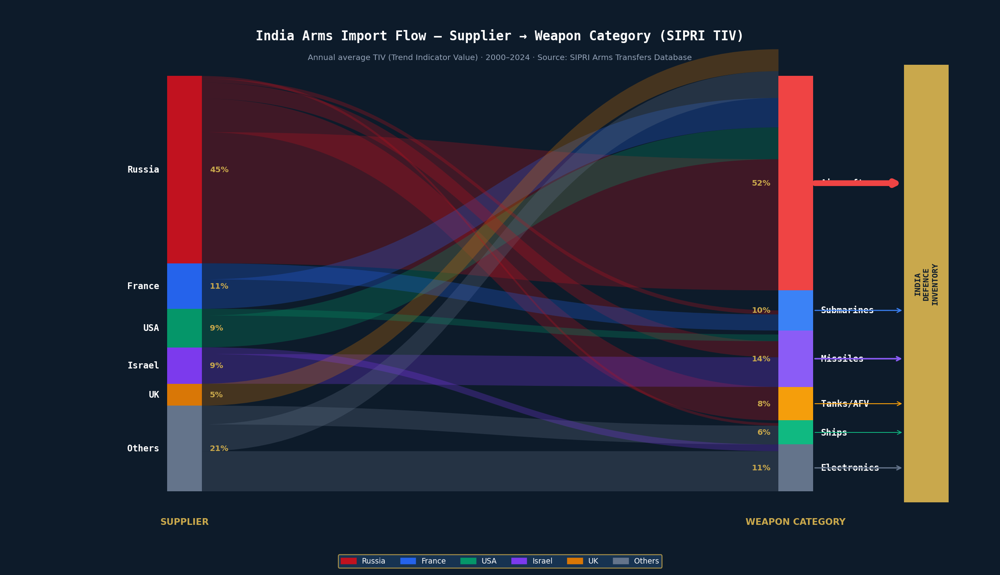

# IndiaShield
### Strategic Defence Intelligence & Analytics Platform

**Last data refresh: 03 Jul 2026**

[](https://public.tableau.com/app/profile/srishti.sharma7103/viz/IndiaShield/StrategicOverview)
[](https://indiashield-h4uhwhqbpkaf9tibxlcefp.streamlit.app/)
[](https://www.python.org/)
[](https://www.sipri.org/databases)
[](https://public.tableau.com/app/profile/srishti.sharma7103/viz/IndiaShield/StrategicOverview)

---

## Overview

IndiaShield is a defence analytics project that analyses 25 years of real data across global military expenditure, India's defence budget allocation, arms import patterns, and defence export growth. The analysis is delivered across two deployments - a **Tableau Public dashboard** for visual storytelling and a **Streamlit web application** for interactive exploration.

All findings in this project are derived from published, real-world data — SIPRI Military Expenditure Database, SIPRI Arms Transfers Database, Ministry of Finance Union Budget statements, Ministry of Defence Annual Reports, and NSE equity data via Yahoo Finance.

---

## Live Deployments

| Interface | Link | Purpose |
|---|---|---|
| 📊 Tableau Dashboard | [View on Tableau Public](https://public.tableau.com/app/profile/srishti.sharma7103/viz/IndiaShield/StrategicOverview) | Primary visual analysis |
| 🖥️ Streamlit App | [Open Web App](https://indiashield-h4uhwhqbpkaf9tibxlcefp.streamlit.app/) | Interactive exploration with filters |

---

## Tableau Dashboard — Published Worksheets

| Sheet | What It Analyses |
|---|---|
| **Strategic Overview** | India's defence spend trajectory (2000–2024) with geopolitical event markers; global military expenditure choropleth |
| **Budget Anatomy** | Capital vs Revenue expenditure split (FY 2015–25); modernisation share declining despite budget growth |
| **Regional Arms Race** | India vs China vs Pakistan in absolute spend and % of GDP; 10-year CAGR comparison |
| **Arms Import Flow** | Sankey diagram mapping India's arms imports from supplier to weapon category by SIPRI TIV |
| **Market Intelligence** | Event study of 6 Indian defence equities across 9 geopolitical escalation events |

---

## Arms Import Flow — Sankey Diagram

The diagram maps India's arms imports from **supplier countries** to **weapon categories**, with flow width proportional to SIPRI Trend Indicator Value (TIV).



> **Source:** SIPRI Arms Transfers Database · Annual average TIV · 2000–2024
> TIV measures military capability transferred, not contract cash value.

---

## Analytical Modules

### Module 1 - Strategic Overview
India's defence expenditure trajectory from 2000 to 2024 in constant 2022 USD, with markers at Kargil (1999), Parliament Attack (2001), Galwan Valley Clash (2020), Russia-Ukraine War (2022), and Operation Sindoor (2025).

**Finding:** India's budget grew from $15.9 Bn (2000) to $86.1 Bn (2024) — a 5.4× increase in constant dollar terms.

---

### Module 2 - Budget Anatomy
Breaks down India's Union Budget defence allocation (FY 2015–16 to FY 2024–25) into Capital Expenditure (weapons acquisition) and Revenue Expenditure (salaries, operations, pensions). Source: Ministry of Finance Statement 6.

**Finding - The Modernisation Paradox:** India's total defence budget grew 2.5× in nominal terms between FY16 and FY25. Yet Capital Expenditure as a share fell from **38.3% to 28.9%**. Of every ₹100 in the defence budget, only ₹29 goes toward buying new military capability.

---

### Module 3 - Regional Arms Race
Military expenditure across 12 countries from 2000–2024 on absolute spend (constant 2022 USD) and as % of GDP.

**Finding - The China Gap:** In 2000, China's budget was 2.1× India's. By 2024 it is **3.7×** ($318 Bn vs $86.1 Bn). China's budget grew 9.6× in constant dollar terms; India's grew 5.4×. The absolute gap widened from ~$17 Bn to ~$232 Bn.

---

### Module 4 - Arms Import Flow
Visualises India's arms import volume by supplier and weapon category using SIPRI TIV data.

**Finding - Supplier Concentration:** Russia supplies **63% of India's total arms import volume** (SIPRI TIV, 2000–2024) — the highest supplier concentration of any major military power. Post-2022 international sanctions have placed spare-parts supply and lifecycle support for Russian-origin platforms under direct pressure.

| Supplier | TIV Share | Dominant Categories |
|---|---|---|
| Russia | **63%** | Aircraft, Tanks/AFV, Missiles |
| France | 11% | Submarines (Scorpene), Aircraft (Rafale) |
| USA | 9% | Transport aircraft, Maritime patrol, Helicopters |
| Israel | 9% | Missiles (Barak-8), Electronics (Phalcon) |
| UK | 5% | Trainer aircraft (Hawk) |
| Others | 21% | Mixed |

---

### Module 5 - Defence Exports: Buyer to Seller
Tracks India's defence export growth from FY17 to FY25 using Ministry of Defence Annual Report data.

**Finding - 15.5× Growth in 8 Years:** India's defence exports grew from ₹1,521 Crore (FY17) to ₹23,622 Crore (FY25) — a 15.5× increase. India now exports to 100+ countries. Key platforms: Brahmos cruise missiles (Philippines), Dornier 228 maritime aircraft, BEL electronic warfare systems. Government target: ₹50,000 Crore by FY29.

---

### Module 6 - Market Intelligence
Event study measuring cumulative returns of 6 Indian defence equities across 9 geopolitical escalation events, over a ±30 trading day window. Alpha = stock return minus Nifty 50 benchmark.

**Finding:** HAL and BEL generate positive cumulative returns in the 30 days following high-severity border escalation events (Uri, Galwan, Balakot), while the Nifty 50 declines — consistent with markets pricing in accelerated procurement decisions after escalations.

---

## Findings Summary

| Finding | What the Data Shows |
|---|---|
| Modernisation Paradox | Capital share: 38.3% (FY16) → 28.9% (FY25) despite 2.5× nominal budget growth |
| China Gap | China grew 9.6× vs India's 5.4× (2000–2024); gap widened from $17 Bn to $232 Bn |
| Supplier Concentration | Russia: **63% of TIV** (SIPRI Arms Transfers DB, 2000–2024) — single largest supplier by volume |
| Buyer-to-Seller Shift | Defence exports: ₹1,521 Cr (FY17) → ₹23,622 Cr (FY25) — 15.5× growth |
| Defence Equity Behaviour | Defence stocks average **17.2%** return post-escalation (**12.8%** Alpha vs Nifty 50) |

---

## Data Sources

| Dataset | Source | Coverage |
|---|---|---|
| Military Expenditure | [SIPRI MILEX Database](https://www.sipri.org/databases/milex) | 12 countries · 2000–2024 · Constant 2022 USD |
| Arms Transfers (TIV) | [SIPRI Arms Transfers Database](https://www.sipri.org/databases/armstransfers) | India imports by supplier & category · 2000–2024 |
| Defence Budget | [Ministry of Finance — Union Budget](https://www.indiabudget.gov.in/) | Statement 6 · FY 2015–16 to FY 2024–25 |
| Defence Exports | [Ministry of Defence Annual Reports](https://mod.gov.in/) | FY 2016–17 to FY 2024–25 |
| Equity Prices | [Yahoo Finance via yfinance](https://finance.yahoo.com/) | HAL, BEL, BEML, MAZDOCK, COCHINSHIP, BDL · 2016–2026 |

## Data Limitations & Pipeline Fallback Logic

*   **Real-time & Verified**: Union Budget allocations (Union Budget Statements), export figures (MoD Annual Reports), and arms import volumes (SIPRI Database) are verified historical datasets.
*   **Listing Constraints**: Tickers are excluded from specific event windows prior to their actual IPO/listing dates (e.g. Mazagon Dock, listed on 12 October 2020, is excluded from Balakot in February 2019) to prevent flatline backfilling.
*   **Pipeline Fallbacks**: The Streamlit application dynamically pulls stock prices via the `yfinance` API. If the API is blocked or offline at runtime, it falls back to a generated geometric Brownian motion (GBM) simulation using historical parameters to keep interactive visualization operational.

---

## Getting Real Stock Data (Important)

The live Streamlit app may use simulated stock prices as a fallback. To replace with real NSE data:

```bash
# Run once locally — downloads actual prices from Yahoo Finance
python fetch_real_data.py

# Then commit the real CSV
git add data/processed/stock_events.csv
git commit -m "Replace simulated stock data with real NSE prices from yfinance"
git push
```

---

## Repository Structure

```
IndiaShield/
├── app.py                           # Streamlit entry point and page router
├── requirements.txt
├── fetch_real_data.py               # Run once to download real NSE stock prices
├── README.md
├── assets/
│   └── sankey_diagram.png
├── data/
│   ├── raw/
│   │   ├── union_budget.csv         # MoF Statement 6
│   │   ├── geopolitical_events.csv
│   │   ├── defence_exports.csv      # MoD Annual Report export figures
│   │   └── README_data.txt
│   └── processed/
│       ├── master_defence.csv
│       ├── budget_breakdown.csv
│       └── stock_events.csv
├── utils/
│   ├── constants.py
│   ├── styling.py
│   └── charts.py
└── modules/
    ├── data_loader.py
    ├── overview.py                  # Module 1 — Strategic Overview
    ├── budget_analysis.py           # Module 2 — Budget Anatomy
    ├── arms_race.py                 # Module 3 — Regional Arms Race
    ├── arms_import_flow.py          # Module 4 — Arms Import Flow
    ├── exports_analysis.py          # Module 5 — Defence Exports
    └── market_intelligence.py       # Module 6 — Market Intelligence
```

---

## Local Setup

```bash
git clone https://github.com/srishti7103/IndiaShield.git
cd IndiaShield
pip install -r requirements.txt
python fetch_real_data.py    # download real stock prices (run once)
streamlit run app.py
```

---

## Tech Stack

| Layer | Technology |
|---|---|
| Primary dashboard | Tableau Public |
| Web application | Python · Streamlit |
| Visualisation | Plotly — Sankey, choropleth, treemap, event study |
| Data processing | Pandas · NumPy |
| Market data | yfinance (NSE equities) |
| Caching | `@st.cache_data` |
| Deployment | Streamlit Community Cloud |
